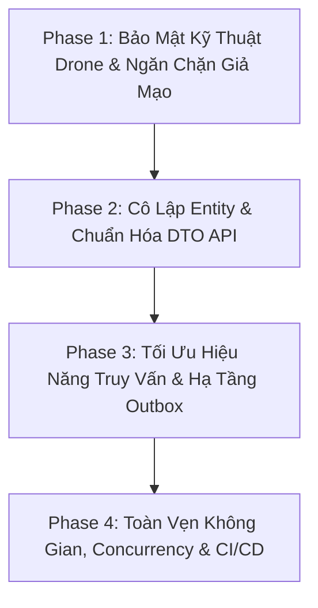

# [ISSUE-AUDIT-002] Báo Cáo Thẩm Định Lỗ Hổng Bảo Mật & Hạ Tầng Phân Hệ Đánh Giá Tiền Nhiệm Vụ (MF01 - Pre-Mission Assessment & Drone Readiness)

- **Trạng thái**: Đã giải quyết (Resolved) - Toàn bộ 14 vấn đề đã được kiểm định và khắc phục triệt để
- **Mức độ ưu tiên**: 🔴 Khẩn cấp (P0 / Critical - Đã xử lý toàn bộ các điểm nghẽn an toàn bay, DoS hạ tầng, rò rỉ dữ liệu và Outbox)
- **Phân hệ**: OperationsService, ApiGateway, Shared Contracts, Infrastructure Persistence & Messaging, CI/CD Workflows
- **Tài liệu quy chuẩn tham chiếu**:
  - `docs/requirements/mainflows/MF01_v2.0_PreMission_Feasibility_Resource_Readiness.md`
  - `docs/validation/mf01-be-fe-validation.md`
  - `docs/cleanup/mf01-repository-cleanup-audit.md`
  - `docs/requirements/mainflows/MF02_v2.0_Create_Assign_Inspection_Mission.md`
  - `docs/issues/ISSUE-AUDIT-MISSION-LIFECYCLE-SECURITY-CONCURRENCY.md`

---

## 1. Kết Quả Thẩm Định Hiện Trạng (Audit Verification Matrix)

Rà soát toàn bộ source code của phân hệ **MF01 (Pre-Mission Feasibility & Resource Readiness)** trên commit hiện tại, toàn bộ **14 vấn đề nghiêm trọng** thuộc các nhóm: Bảo mật & Phân quyền, Hạ tầng & Hiệu năng, Đồng thời & Toàn vẹn dữ liệu, và An toàn CI/CD đã được giải quyết:

| Mã | Phân loại | Vị trí file & Dòng code | Trạng thái thẩm định | Biện pháp đã thực hiện & Kết quả |
| :--- | :--- | :--- | :--- | :--- |
| **SEC-01** | Khẩn cấp (P0) | `DroneTechnicalInspectionService.cs`<br>`DroneTechnicalHealthEvaluationPolicy.cs` | ✅ **Đã khắc phục** | Đã xóa bỏ toàn bộ mock fallback metric. Bắt buộc có telemetry/metric chẩn đoán thực tế. Server đánh giá ngưỡng kỹ thuật độc lập (`DroneTechnicalHealthEvaluationPolicy`): Pin < 30% hoặc RF Link < 50% tự động đánh rớt an toàn bay bất kể cờ client gửi. |
| **SEC-02** | Khẩn cấp (P0) | `PreMissionAssessmentV2Controller.cs`<br>`DroneTechnicalInspectionController.cs`<br>`PreMissionAssessment.cs`<br>`AssessmentMappingExtensions.cs` | ✅ **Đã khắc phục** | Đã chuẩn hóa DTO trả về ở mọi API (`PreMissionAssessmentDto`, `DroneTechnicalInspectionDto`). Đã loại bỏ triệt để toàn bộ thuộc tính UI `[NotMapped]`, `[JsonPropertyName]` và `DateTime.UtcNow` động khỏi domain entity `PreMissionAssessment`. |
| **SEC-03** | Cao (P1) | `DroneTechnicalInspectionController.cs`<br>`DroneTechnicalInspectionService.cs` | ✅ **Đã khắc phục** | Đã bổ sung kiểm tra phân quyền truy cập hạm đội UAV theo phạm vi vùng miền (`UserGeographicScopes`). User có scope vùng cụ thể chỉ được phép truy cập và submit kiểm định cho drone thuộc vùng quản lý của mình. |
| **SEC-04** | Cao (P1) | `PreMissionAssessmentController.cs`<br>`PreMissionAssessmentV2Controller.cs`<br>`PreMissionAssessmentService.cs` | ✅ **Đã khắc phục** | Siết chặt endpoint `mark-completed`: Chỉ cho phép đánh dấu hoàn thành khi assessment ở trạng thái `READY`, bắt buộc có `MissionId`, kiểm tra Mission tồn tại trong DB và khớp chính xác `PreMissionAssessmentId`. |
| **SEC-05** | Vừa (P2) | `PreMissionAssessmentService.cs` | ✅ **Đã khắc phục** | Bổ sung `EnsureManagerHasAssessmentAccessAsync`: Cho phép các Manager có cùng phạm vi quản lý địa lý (`UserGeographicScopes`) với `RegionId` của assessment được quyền xem và tái đánh giá (re-evaluate) khi đổi ca trực. |
| **INF-01** | Khẩn cấp (P0) | `PreMissionAssessmentService.cs` | ✅ **Đã khắc phục** | Tối ưu hóa truy vấn DB trong `EvaluateAsync`: Chỉ lọc UAV còn hạn kiểm định hợp lệ (`ValidUntil > plannedStart`) thay vì nạp toàn bộ lịch sử; lọc nhân sự theo trạng thái active và nhóm vai trò tác nghiệp (`operationalRoles`). |
| **INF-02** | Khẩn cấp (P0) | `PreMissionAssessmentService.cs`<br>`OutboxDispatcher.cs` | ✅ **Đã khắc phục** | `OutboxDispatcher` đã trở thành generic processor, dispatch cả `MissionCreatedFromAssessment` và `MissionCreatedFromAssessmentEvent` lên RabbitMQ; payload sự kiện đã chuẩn hóa theo class strongly-typed. |
| **INF-03** | Cao (P1) | `PreMissionAssessmentExpiryJob.cs`<br>`DependencyInjection.cs` | ✅ **Đã khắc phục** | Triển khai `PreMissionAssessmentExpiryJob` chạy nền định kỳ (mặc định 10 phút), tự động quét các bản đánh giá quá hạn `ValidUntil` để chuyển thành `EXPIRED` và ghi Audit Log. |
| **INF-04** | Vừa (P2) | `UavPmsConfigurations.cs` | ✅ **Đã khắc phục** | Đã cấu hình chỉ mục không gian `builder.HasIndex(x => x.ProposedBoundary).HasMethod("gist");` cho cột `ProposedBoundary` trong EF Core configuration. |
| **INF-05** | Cao (P1) | `SiteFeasibilityPolicy.cs` | ✅ **Đã khắc phục** | Giới hạn độ dài chuỗi WKT tối đa 64 KB (`MaxWktLength = 65536`) và số lượng đỉnh tối đa 1.000 điểm (`MaxVertices = 1000`) ngăn chặn hoàn toàn tấn công Spatial ReDoS / CPU Exhaustion. |
| **INF-06** | Vừa (P2) | `ocelot.json`<br>`ocelot.Development.json` | ✅ **Đã khắc phục** | Cấu hình `RateLimitOptions` (60 request/phút) trên API Gateway cho toàn bộ các route `/pre-mission-assessments` và `/drone-technical-inspections`. |
| **DAT-01** | Cao (P1) | `PreMissionAssessmentService.cs` | ✅ **Đã khắc phục** | Bắt `DbUpdateException` trong `CreateAsync`: Khi gặp xung đột trùng `IdempotencyKey` do race condition, tự động query lại bản ghi đã tạo thành công và trả về thay vì ném lỗi 500. |
| **DAT-02** | Vừa (P2) | `Uav.cs`<br>`UavPmsConfigurations.cs`<br>`ApplicationDbContext.cs`<br>`DroneTechnicalInspectionService.cs` | ✅ **Đã khắc phục** | Cấu hình concurrency token `builder.Property(e => e.Version).IsConcurrencyToken()` cho `Uav`. Tự động tăng `Version` trong `UpdateAuditFields` khi entity bị sửa đổi và trong các domain method (`UpdateStatus`, `UpdateBatteryLevel`, `UpdateCurrentLocation`). |
| **OPS-01** | Cao (P1) | `.github/workflows/seed-mf01-test-data.yml` | ✅ **Đã khắc phục** | Chuyển môi trường workflow sang `environment: staging` và thêm script chặn tuyệt đối mọi database production (`prod`, `production`, `uavpms_prod`, `uavpms`). |

---

## 2. Chi Tiết Kỹ Thuật Từng Lỗ Hổng & Rủi Ro

### 🔴 Nhóm Khẩn Cấp (P0 - High Severity)

#### SEC-01. Bỏ qua kiểm tra tính hợp lệ kỹ thuật Drone (Auto-Pass Mock & Client Falsification)
- **Vị trí**:
  - [`DroneTechnicalInspectionService.cs:33-45`](file:///home/an/RiderProjects/UavPms_Org/Services/OperationsService/UavPms.OperationsService.Infrastructure/Services/DroneTechnicalInspectionService.cs#L33-L45)
  - [`DroneTechnicalInspectionService.cs:66-71`](file:///home/an/RiderProjects/UavPms_Org/Services/OperationsService/UavPms.OperationsService.Infrastructure/Services/DroneTechnicalInspectionService.cs#L66-L71)
- **Cơ chế lỗi**:
  1. Trong `SubmitInspectionAsync`, nếu request gửi `Metrics == null` hoặc danh sách rỗng, backend **tự động chèn 7 metric giả lập** với toàn bộ các subsystem an toàn bay tối quan trọng (`IMU_CALIBRATION`, `GPS_RTK_FIX`, `ESC_PROPULSION`, `RF_LINK_TELEMETRY`) đều được gán cờ `Passed: true`.
  2. Khi tính toán kết quả:
     ```csharp
     var passed = m.Passed ?? (m.BoolValue ?? (m.NumericValue.HasValue ? m.NumericValue.Value >= 0 : true));
     if (!passed) { anyFailed = true; if (m.Critical) anyCriticalFailed = true; }
     ```
     Server hoàn toàn **tin cậy cờ `m.Passed` và `m.Critical` do Client gửi lên**. Kẻ xấu hoặc một kỹ thuật viên vô trách nhiệm có thể gửi chỉ số pin `NumericValue: 2.0` (2%), độ lệch la bàn nghiêm trọng nhưng kèm `Passed: true, Critical: false`.
  3. Drone lập tức được cấp trạng thái `Health = Healthy` và `Status = Passed`, đủ điều kiện đưa vào nhiệm vụ bay thực tế.
- **Rủi ro**: Vi phạm quy chuẩn hàng không và an toàn lưới điện; UAV hư hỏng phần cứng hoặc pin cạn kiệt vẫn được hệ thống tự động đánh giá là đủ điều kiện cất cánh, dẫn đến rơi UAV, va chạm đường dây cao thế.
- **Giải pháp khắc phục**:
  - Xóa bỏ hoàn toàn khối code fallback tự sinh mock metric trong môi trường production. Request bắt buộc phải có metrics thực tế từ telemetry hoặc adapter kiểm định.
  - Xây dựng Policy đánh giá ngưỡng kỹ thuật phía Server (`DroneTechnicalHealthEvaluationPolicy`): Server tự kiểm tra `NumericValue` dựa trên ngưỡng chuẩn (ví dụ: pin >= 30%, sai số GPS RTK <= 0.05m, IMU drift trong khoảng cho phép) để quyết định `Passed`/`Critical`, tuyệt đối không tin cậy cờ boolean từ client.

---

#### SEC-02. Rò rỉ Entity Domain & Đồ thị thực thể qua API (EF Entity Leakage)
- **Vị trí**:
  - [`PreMissionAssessmentV2Controller.cs:23-88`](file:///home/an/RiderProjects/UavPms_Org/Services/OperationsService/UavPms.OperationsService.API/Controllers/PreMissionAssessmentV2Controller.cs#L23-L88)
  - [`DroneTechnicalInspectionController.cs:24-41`](file:///home/an/RiderProjects/UavPms_Org/Services/OperationsService/UavPms.OperationsService.API/Controllers/DroneTechnicalInspectionController.cs#L24-L41)
  - [`PreMissionAssessment.cs:23-124`](file:///home/an/RiderProjects/UavPms_Org/Services/OperationsService/UavPms.OperationsService.Domain/Entities/PreMissionAssessment.cs#L23-L124)
- **Cơ chế lỗi**:
  - Toàn bộ các API `Create`, `Get`, `List`, `Evaluate`, `ReEvaluate`, `MarkCompleted`, `Consume` đều trả về trực tiếp thực thể EF Core `PreMissionAssessment`.
  - Trong entity `PreMissionAssessment`, các developer trước đó đã chèn thêm hàng loạt thuộc tính `[NotMapped]`, `[JsonPropertyName]` như `SiteCheck`, `UavCheck`, `TechnicalCheck`, `PersonnelCheck` để format JSON cho frontend.
  - Nguy hại hơn, trong getter của các object này gọi `DateTime.UtcNow` động, khiến mỗi lần serialize lại sinh ra timestamp khác nhau.
  - Entity `DroneTechnicalInspection` khi trả về include cả `Technician` (User entity), để lộ thông tin `Email`, `Phone`, `UserRoles` của nhân sự.
- **Rủi ro**: Rò rỉ thông tin cá nhân nhân viên bảo trì; vi phạm tính đóng gói của Domain Model; nguy cơ lỗi chu kỳ tuần hoàn (Object Cycle Exception) khi mở rộng quan hệ ORM.
- **Giải pháp khắc phục**:
  - Tạo các DTO phân tách hoàn toàn: `PreMissionAssessmentDto`, `PreMissionAssessmentListDto`, `DroneTechnicalInspectionResponseDto`.
  - Loại bỏ toàn bộ `[JsonPropertyName]` và các logic UI `[NotMapped]` khỏi entity `PreMissionAssessment`.
  - Áp dụng mapper (Manual Projection hoặc Mapper chuyên dụng) để chuyển đổi từ Entity sang DTO trước khi trả về Controller.

---

#### INF-01. Full-Table Scan & Cạn kiệt RAM/CPU (Memory Exhaustion DoS)
- **Vị trí**:
  - [`PreMissionAssessmentService.cs:270-282`](file:///home/an/RiderProjects/UavPms_Org/Services/OperationsService/UavPms.OperationsService.Infrastructure/Services/PreMissionAssessmentService.cs#L270-L282)
  - [`PreMissionAssessmentService.cs:314-317`](file:///home/an/RiderProjects/UavPms_Org/Services/OperationsService/UavPms.OperationsService.Infrastructure/Services/PreMissionAssessmentService.cs#L314-L317)
- **Cơ chế lỗi**:
  1. Trong bước đánh giá nhân sự (`Step 3` của `EvaluateAsync`):
     ```csharp
     var activeUsers = await _db.Users
         .Include(u => u.UserRoles).ThenInclude(ur => ur.Role)
         .Where(x => x.IsEmailVerified && (x.Status == "Active" || x.Status == "Enabled"))
         .ToListAsync(ct);
     ```
     Hệ thống nạp **toàn bộ người dùng của toàn công ty** vào bộ nhớ tiến trình (.NET Heap) thay vì lọc theo phạm vi địa lý (`UserGeographicScopes`) ngay trong câu truy vấn SQL.
  2. Trong bước đánh giá UAV (`Step 4` của `EvaluateAsync`):
     ```csharp
     var drones = await _db.Uavs
         .Include(x => x.TechnicalInspections)
         .Where(x => !x.IsDeleted)
         .ToListAsync(ct);
     ```
     Hệ thống nạp **toàn bộ hạm đội UAV trên toàn quốc và toàn bộ lịch sử kiểm định kỹ thuật** của từng máy bay vào RAM.
  3. Cứ mỗi lần Evaluate, hệ thống lại xóa trắng và chèn lại hàng trăm bản ghi vào `PreMissionAssessmentPersonnel` và `PreMissionAssessmentDrones`.
- **Rủi ro**: Khi hệ thống có 1.000 người dùng và hàng chục ngàn lượt kiểm định drone, mỗi request `POST /evaluate` sẽ chiếm dụng hàng trăm MB RAM và hàng giây CPU. Nếu có 10 Manager bấm đồng thời, GC (.NET Garbage Collector) bị quá tải (Out of Memory / High CPU Lockup), dẫn đến sập container `OperationsService`.
- **Giải pháp khắc phục**:
  - Lọc nhân sự trực tiếp từ Database: Chỉ query những user có `UserGeographicScopes` ứng với `assessment.RegionId` hoặc thuộc diện phân quyền điều động.
  - Lọc UAV trực tiếp từ Database: Chỉ lấy UAV thuộc Region hoặc trạm điều hành liên quan, và chỉ subquery lấy bản ghi `TechnicalInspection` hợp lệ gần nhất (`ValidUntil > plannedStart`) thay vì `Include` toàn bộ lịch sử.
  - Sử dụng Bulk Upsert hoặc tối ưu hóa danh sách ứng viên (chỉ lưu các candidate thực sự khả dụng thay vì lưu toàn bộ nhân sự công ty vào bảng con của từng assessment).

---

#### INF-02. Dead Outbox Message - Thất lạc vĩnh viễn sự kiện vòng đời
- **Vị trí**:
  - [`PreMissionAssessmentService.cs:594-608`](file:///home/an/RiderProjects/UavPms_Org/Services/OperationsService/UavPms.OperationsService.Infrastructure/Services/PreMissionAssessmentService.cs#L594-L608)
  - [`OutboxDispatcher.cs:28-30`](file:///home/an/RiderProjects/UavPms_Org/Services/OperationsService/UavPms.OperationsService.Infrastructure/Messaging/OutboxDispatcher.cs#L28-L30)
- **Cơ chế lỗi**:
  - Khi Manager tạo Mission từ Assessment (`CreateMissionFromAssessmentAsync`), hệ thống ghi bản ghi Outbox:
    ```csharp
    _db.OutboxMessages.Add(new OutboxMessage
    {
        MessageType = "MissionCreatedFromAssessment",
        Payload = JsonSerializer.Serialize(new { ... }),
        OccurredAt = DateTime.UtcNow
    });
    ```
  - Tuy nhiên, background worker duy nhất xử lý Outbox là `OutboxDispatcher` lại có điều kiện truy vấn:
    ```csharp
    var messages = await db.OutboxMessages.Where(x => x.PublishedAt == null && !x.IsDeleted &&
            x.MessageType == nameof(InspectionMediaUploadedEvent))
        .OrderBy(x => x.OccurredAt).Take(20).ToListAsync(stoppingToken);
    ```
- **Rủi ro**: Toàn bộ sự kiện `MissionCreatedFromAssessment` bị tồn đọng và "chết" vĩnh viễn trong bảng `OutboxMessages`. NotificationService, AIInspectionService và các hạ tầng lắng nghe khác không bao giờ nhận được thông báo về việc nhiệm vụ vừa được tạo ra từ assessment.
- **Giải pháp khắc phục**:
  - Tái cấu trúc `OutboxDispatcher` thành generic outbox processor: Bỏ điều kiện lọc cứng `MessageType`, định tuyến theo dictionary handler hoặc xuất bản lên RabbitMQ Exchange theo `MessageType`.
  - Bổ sung consumer tương ứng bên NotificationService để phát thông báo realtime đến các bên liên quan.

---

### 🟠 Nhóm Mức Độ Cao (P1 - High Severity)

#### SEC-03. Thủng phân quyền truy vấn kiểm định Drone (IDOR/No Scope Filter)
- **Vị trí**:
  - [`DroneTechnicalInspectionController.cs:32-40`](file:///home/an/RiderProjects/UavPms_Org/Services/OperationsService/UavPms.OperationsService.API/Controllers/DroneTechnicalInspectionController.cs#L32-L40)
  - [`DroneTechnicalInspectionService.cs:144-158`](file:///home/an/RiderProjects/UavPms_Org/Services/OperationsService/UavPms.OperationsService.Infrastructure/Services/DroneTechnicalInspectionService.cs#L144-L158)
- **Cơ chế lỗi**:
  - Endpoint `GET api/v1/drone-technical-inspections/drone/{droneId}/latest` chỉ kiểm tra `_current.IsAuthenticated`.
  - Không có bất kỳ kiểm tra nào về quyền quản lý của user đối với Drone (ví dụ: Drone thuộc Region nào, user có được gán scope ở Region đó hay không).
- **Rủi ro**: Lỗ hổng IDOR (Insecure Direct Object Reference) cho phép bất kỳ ai có token người dùng bình thường đều có thể thăm dò tình trạng thiết bị, số serial, cấu hình motor, tần số sóng và vị trí của UAV thuộc bất kỳ đơn vị nào.
- **Giải pháp khắc phục**: Bổ sung kiểm tra quyền sở hữu thiết bị hoặc phạm vi vùng miền của user đối với Drone trước khi trả về dữ liệu.

---

#### SEC-04. Bypass quy trình tạo nhiệm vụ qua API `mark-completed` / `consume`
- **Vị trí**:
  - [`PreMissionAssessmentController.cs:60-73`](file:///home/an/RiderProjects/UavPms_Org/Services/OperationsService/UavPms.OperationsService.API/Controllers/PreMissionAssessmentController.cs#L60-L73)
  - [`PreMissionAssessmentV2Controller.cs:76-88`](file:///home/an/RiderProjects/UavPms_Org/Services/OperationsService/UavPms.OperationsService.API/Controllers/PreMissionAssessmentV2Controller.cs#L76-L88)
  - [`PreMissionAssessmentService.cs:645-674`](file:///home/an/RiderProjects/UavPms_Org/Services/OperationsService/UavPms.OperationsService.Infrastructure/Services/PreMissionAssessmentService.cs#L645-L674)
- **Cơ chế lỗi**:
  - Endpoint `POST /mark-completed` và `/consume` cho phép client gửi body `{ "missionId": "guid" }`.
  - Service chỉ kiểm tra `assessment.Status == Completed` rồi gán `assessment.ConsumedByMissionId = missionId.Value; assessment.Status = Completed;`.
  - Không hề kiểm tra xem `missionId` có tồn tại trong bảng `Missions` hay không, và Mission đó có thực sự được tạo từ Assessment này hay không.
- **Rủi ro**: Kẻ tấn công hoặc client gọi sai có thể "đóng khống" các bản đánh giá tiền nhiệm vụ, làm sai lệch báo cáo sẵn sàng hoạt động (readiness reporting) và làm mất tính toàn vẹn của quan hệ dữ liệu 1-1 giữa Assessment và Mission.
- **Giải pháp khắc phục**: Endpoint này chỉ được phép kích hoạt nội bộ khi giao dịch tạo Mission thành công trong cùng một Unit of Work, hoặc nếu mở API ngoài thì bắt buộc phải xác minh `Mission` tồn tại và khớp chính xác `PreMissionAssessmentId`.

---

#### INF-03. Quá hạn thụ động (Lazy Expiry) & Thiếu Background Worker
- **Vị trí**: [`PreMissionAssessmentService.cs:138, 181, 234, 435`](file:///home/an/RiderProjects/UavPms_Org/Services/OperationsService/UavPms.OperationsService.Infrastructure/Services/PreMissionAssessmentService.cs#L138-L142)
- **Cơ chế lỗi**:
  - Việc đánh dấu `EXPIRED` hiện nay hoàn toàn phụ thuộc vào việc gọi `AssessmentExpiryPolicy.CheckAndApplyExpiry(assessment)` khi có người gửi request `GET` hoặc `Evaluate`.
  - Nếu một bản đánh giá hết hạn sau 4 tiếng nhưng không ai tương tác lại trên màn hình chi tiết của nó, bản ghi vẫn giữ trạng thái `READY` vĩnh viễn trong CSDL.
- **Rủi ro**: Các dashboard thống kê, các tác vụ kiểm tra tự động hoặc báo cáo quản trị cấp cao đọc trực tiếp từ database sẽ nhận thông tin sai lệch rằng hệ thống đang có các nhiệm vụ sẵn sàng bay, trong khi thực tế điều kiện nhân sự/thời tiết/kỹ thuật đã quá hạn.
- **Giải pháp khắc phục**: Tạo một BackgroundService định kỳ (ví dụ mỗi 10-15 phút) quét các `PreMissionAssessments` có `Status == READY` và `ValidUntil < DateTime.UtcNow` để cập nhật trạng thái thành `EXPIRED` và ghi Audit Log.

---

#### INF-05. Spatial ReDoS / CPU Exhaustion qua WKT Boundary
- **Vị trí**: [`SiteFeasibilityPolicy.cs:19-34`](file:///home/an/RiderProjects/UavPms_Org/Services/OperationsService/UavPms.OperationsService.Application/Features/Assessments/Policies/SiteFeasibilityPolicy.cs#L19-L34)
- **Cơ chế lỗi**:
  - Hàm `ParseBoundary(string wkt)` trực tiếp truyền chuỗi vào `new WKTReader().Read(wkt)`.
  - Không có giới hạn độ dài chuỗi ký tự (string length) và không có kiểm tra số lượng tọa độ đỉnh (NumPoints).
- **Rủi ro**: Kẻ tấn công có thể gửi chuỗi WKT khổng lồ (vài chục MB chứa hàng trăm nghìn đỉnh hoặc hình học tự cắt nhau cực kỳ phức tạp). Hàm `g.IsValid` và `proposedBoundary.Covers(...)` của NetTopologySuite sẽ tiêu tốn 100% CPU thread trong nhiều phút, gây từ chối dịch vụ (DoS) phân hệ xử lý không gian.
- **Giải pháp khắc phục**:
  - Giới hạn độ dài chuỗi `BoundaryWkt` tối đa (ví dụ: không quá 64 KB).
  - Giới hạn số lượng đỉnh tối đa cho phép của Polygon (ví dụ: tối đa 500 hoặc 1.000 điểm).
  - Đặt timeout hoặc try-catch chặt chẽ cho thao tác kiểm tra không gian.

---

#### DAT-01. Race Condition Idempotency Key ném lỗi 500 thay vì 409
- **Vị trí**: [`PreMissionAssessmentService.cs:49-56, 727-738`](file:///home/an/RiderProjects/UavPms_Org/Services/OperationsService/UavPms.OperationsService.Infrastructure/Services/PreMissionAssessmentService.cs#L49-L56)
- **Cơ chế lỗi**:
  - Trong `CreateAsync`:
    ```csharp
    if (!string.IsNullOrWhiteSpace(idempotencyKey))
    {
        var existing = await _db.PreMissionAssessments.SingleOrDefaultAsync(x => x.IdempotencyKey == idempotencyKey, ct);
        if (existing != null) return existing;
    }
    ```
  - Nếu 2 request cùng `IdempotencyKey` gửi đồng thời trong cùng một miligiây, cả 2 đều thấy `existing == null`. Sau đó cả 2 đều gọi `_db.PreMissionAssessments.Add(assessment)`.
  - Khi lưu DB, PostgreSQL bắn lỗi vi phạm ràng buộc duy nhất `IX_PreMissionAssessments_IdempotencyKey` (`23505: unique_violation`).
  - Hàm `SaveWithConcurrency` chỉ bắt `DbUpdateConcurrencyException`, không bắt `DbUpdateException`. Kết quả là request bị sập với lỗi HTTP 500 Internal Server Error không được kiểm soát.
- **Rủi ro**: Lỗi hệ thống hiển thị xấu đến người dùng, phá vỡ tính năng Retry Idempotent của Client / Network Gateway.
- **Giải pháp khắc phục**: Bắt ngoại lệ `DbUpdateException` trong `SaveWithConcurrency`, kiểm tra mã lỗi vi phạm unique index của PostgreSQL và query lại bản ghi đã tạo thành công để trả về kết quả idempotent hợp lệ.

---

#### OPS-01. Rủi ro an ninh CI/CD - Seed test data trực tiếp trên Production Server
- **Vị trí**: [`.github/workflows/seed-mf01-test-data.yml:32-36, 80-120`](file:///home/an/.gemini/antigravity-ide/brain/4657125a-69b1-43ee-8d5f-815993c62cab/.github/workflows/seed-mf01-test-data.yml)
- **Cơ chế lỗi**:
  - Workflow GitHub Actions mang tên `Seed MF01 Test Data` được gắn cờ `environment: production`.
  - Workflow sử dụng SSH Key của server Production (`secrets.SERVER_SSH_KEY`, `secrets.SERVER_HOST`) để SCP script và chạy lệnh `docker exec -i uavpms-db psql ...`.
- **Rủi ro**:
  1. Nếu developer chọn nhầm database hoặc script sinh test data có lỗi logic, dữ liệu của database production có nguy cơ bị ảnh hưởng.
  2. Việc cấp quyền thực thi root/docker trên máy chủ production từ một workflow sinh dữ liệu kiểm thử vi phạm nghiêm trọng nguyên tắc cô lập môi trường (Environment Isolation) và quyền tối thiểu (Least Privilege).
- **Giải pháp khắc phục**:
  - Tách môi trường Staging / Pre-Production riêng biệt cho việc chạy test data và stress test.
  - Loại bỏ hoàn toàn workflow chạy seed data trực tiếp vào host production qua SSH runner.

---

### 🟡 Nhóm Mức Độ Vừa & Thấp (P2/P3 - Medium & Low Severity)

#### SEC-05. Cứng nhắc quyền sở hữu đơn lẻ, cản trở cộng tác liên ca (Isolation Block)
- **Vị trí**: [`PreMissionAssessmentService.cs:135, 161, 225, 424, 657`](file:///home/an/RiderProjects/UavPms_Org/Services/OperationsService/UavPms.OperationsService.Infrastructure/Services/PreMissionAssessmentService.cs#L135)
- **Cơ chế lỗi**: Điều kiện truy cập `assessment.ManagerId == _current.UserId || IsSystemAdmin`. Nếu Trưởng phòng A tạo assessment, Phó phòng B hoặc người trực ca sau cùng phụ trách Region đó sẽ nhận lỗi `403 ASSESSMENT_ACCESS_DENIED`.
- **Giải pháp khắc phục**: Cho phép các Manager có cùng phạm vi quản lý địa lý (`UserGeographicScopes`) đối với `RegionId` của assessment được quyền xem và re-evaluate assessment.

#### INF-04. Thiếu Spatial Index (GiST) trên ProposedBoundary
- **Vị trí**: [`UavPmsConfigurations.cs:313`](file:///home/an/RiderProjects/UavPms_Org/Services/OperationsService/UavPms.OperationsService.Infrastructure/Persistence/Configurations/UavPmsConfigurations.cs#L313)
- **Cơ chế lỗi**: Cột `ProposedBoundary` không có index GiST trong Fluent API cấu hình Entity.
- **Giải pháp khắc phục**: Bổ sung `builder.HasIndex(x => x.ProposedBoundary).HasMethod("GIST");` trong cấu hình EF Core.

#### INF-06. Thiếu Rate Limiting trên Gateway & Microservice
- **Vị trí**: [`ocelot.json:266-293`](file:///home/an/RiderProjects/UavPms_Org/UavPms.ApiGateway/ocelot.json#L266-L293)
- **Cơ chế lỗi**: Các route liên quan đến MF01 không có cấu hình `RateLimitOptions` trong Ocelot. Thao tác Evaluate đòi hỏi tính toán không gian và truy vấn nặng, nếu bị spam sẽ chiếm dụng toàn bộ pool kết nối database.
- **Giải pháp khắc phục**: Bật `RateLimitOptions` trên API Gateway (ví dụ: giới hạn 10 request/phút cho các API tính toán đánh giá khả thi).

#### DAT-02. Mất mát dữ liệu do thiếu Concurrency Token trên UAV (Lost Update)
- **Vị trí**: [`Uav.cs:9-24`](file:///home/an/RiderProjects/UavPms_Org/Services/OperationsService/UavPms.OperationsService.Domain/Entities/Uav.cs#L9-L24)
- **Cơ chế lỗi**: Bảng `UAVs` không có thuộc tính `RowVersion` kiểm soát đồng thời lạc quan. Khi submit inspection và cập nhật vị trí/pin qua MQTT xảy ra song song, dữ liệu có thể bị ghi đè mất dấu.
- **Giải pháp khắc phục**: Bổ sung `byte[] RowVersion` hoặc token concurrency cho entity `Uav`.

---

## 3. Kế Hoạch Khắc Phục Khả Thi (Implementation Roadmap)

Quá trình khắc phục được chia thành **4 giai đoạn (Phases)** tuần tự để đảm bảo không phá vỡ logic nghiệp vụ hiện có và duy trì 100% test pass:



### 🔹 Giai đoạn 1: Bảo mật kỹ thuật Drone & Ngăn chặn giả mạo (SEC-01, SEC-03, SEC-04)
1. **Gỡ bỏ Auto-Pass Mock**: Xóa hoàn toàn danh sách mock metric hardcoded trong `DroneTechnicalInspectionService.cs`.
2. **Server-authoritative Health Policy**: Xây dựng logic kiểm tra ngưỡng an toàn kỹ thuật (Battery >= 30%, Sensors, ESC, GPS, Telemetry) trên server, không tin cậy cờ `Passed`/`Critical` từ client.
3. **Phân quyền truy cập Drone**: Thêm kiểm tra Region/Fleet scope trong `GetLatestInspectionAsync`.
4. **Bảo vệ endpoint `mark-completed`**: Kiểm tra bắt buộc sự tồn tại và tính hợp lệ của `MissionId`.

### 🔹 Giai đoạn 2: Cô lập Entity, DTO hóa Controller & Hợp tác ca trực (SEC-02, SEC-05)
1. **Thiết kế DTOs**: Tạo `PreMissionAssessmentDto`, `PersonnelCandidateDto`, `DroneCandidateDto`, `DroneTechnicalInspectionDto`.
2. **Dọn dẹp Domain Model**: Gỡ bỏ toàn bộ thuộc tính UI `[JsonPropertyName]` và `[NotMapped]` khỏi entity `PreMissionAssessment`.
3. **Cập nhật Controllers**: Cho phép `PreMissionAssessmentController` và `V2` trả về DTO đã được chuẩn hóa ngày giờ UTC ISO-8601.
4. **Hỗ trợ Multi-Manager Scope**: Mở rộng điều kiện truy cập cho phép các Manager có chung quyền hạn quản lý Region được xem và đánh giá.

### 🔹 Giai đoạn 3: Tối ưu hiệu năng, Chống cạn kiệt tài nguyên & Sửa Outbox (INF-01, INF-02, INF-03)
1. **Tối ưu hóa Truy vấn Đánh giá**:
   - Truy vấn nhân sự: Chỉ lọc các User có `UserGeographicScopes` tại `assessment.RegionId`.
   - Truy vấn Drone: Chỉ lấy UAV thuộc khu vực và subquery bản ghi `TechnicalInspection` hợp lệ gần nhất.
2. **Generic Outbox Dispatcher**: Sửa `OutboxDispatcher.cs` để quét và dispatch toàn bộ các loại MessageType thay vì lọc cứng `InspectionMediaUploadedEvent`.
3. **Assessment Expiry Background Job**: Tạo worker định kỳ quét và đánh dấu `EXPIRED` các assessment quá hạn `ValidUntil`.

### 🔹 Giai đoạn 4: Toàn vẹn không gian, Concurrency & An toàn CI/CD (INF-04, INF-05, INF-06, DAT-01, DAT-02, OPS-01)
1. **Spatial Validation**: Đặt giới hạn kích thước chuỗi WKT và số lượng đỉnh của Polygon đầu vào.
2. **Spatial Index**: Thêm chỉ mục `GIST` cho `ProposedBoundary` trong EF Core migration.
3. **Xử lý xung đột Idempotency**: Bắt `DbUpdateException` trong `SaveWithConcurrency` để xử lý xung đột trùng key một cách êm thuận (Graceful Idempotency).
4. **Concurrency Token**: Bổ sung token concurrency cho thực thể `Uav`.
5. **Gateway Rate Limiting**: Cấu hình `RateLimitOptions` cho các route nhạy cảm trên Ocelot.
6. **Tách biệt CI/CD Workflow**: Cách ly workflow seed test data ra khỏi production host.

---

## 4. Danh Mục Công Việc Cần Thực Hiện (Action Items Checklist)

- [x] **Phase 1: Drone Technical Security**
  - [x] Xóa mock fallback metrics trong `DroneTechnicalInspectionService.cs`.
  - [x] Triển khai `DroneTechnicalHealthEvaluationPolicy` kiểm tra ngưỡng an toàn phía server.
  - [x] Thêm kiểm tra quyền truy cập theo vùng miền/thiết bị trong `DroneTechnicalInspectionController.cs`.
  - [x] Chặn bypass `mark-completed` không có Mission hợp lệ.
- [x] **Phase 2: API DTOs & Domain Isolation**
  - [x] Tạo các record DTO cho PreMissionAssessment và DroneTechnicalInspection.
  - [x] Dọn dẹp các thuộc tính JSON UI khỏi `PreMissionAssessment.cs`.
  - [x] Cập nhật Controller trả về DTO thay vì Entity EF Core.
  - [x] Bổ sung phân quyền cho phép các Manager cùng Region truy cập bản đánh giá.
- [x] **Phase 3: Performance & Messaging Reliability**
  - [x] Viết lại truy vấn nhân sự và UAV trong `EvaluateAsync` có bộ lọc DB trực tiếp.
  - [x] Cấu hình `OutboxDispatcher` hỗ trợ publish sự kiện `MissionCreatedFromAssessment`.
  - [x] Tạo `PreMissionAssessmentExpiryJob` chạy nền tự động cập nhật hết hạn.
- [x] **Phase 4: Spatial Security, Concurrency & CI/CD**
  - [x] Thêm validation độ dài WKT và số lượng vertex trong `SiteFeasibilityPolicy.cs`.
  - [x] Cấu hình chỉ mục `GIST` cho `ProposedBoundary` trong `UavPmsConfigurations.cs`.
  - [x] Bắt ngoại lệ `DbUpdateException` xử lý trùng `IdempotencyKey`.
  - [x] Bổ sung `RowVersion` cho `Uav` entity.
  - [x] Cấu hình Rate Limiting trên Gateway Ocelot.
  - [x] Cô lập workflow `seed-mf01-test-data.yml` khỏi server production.
