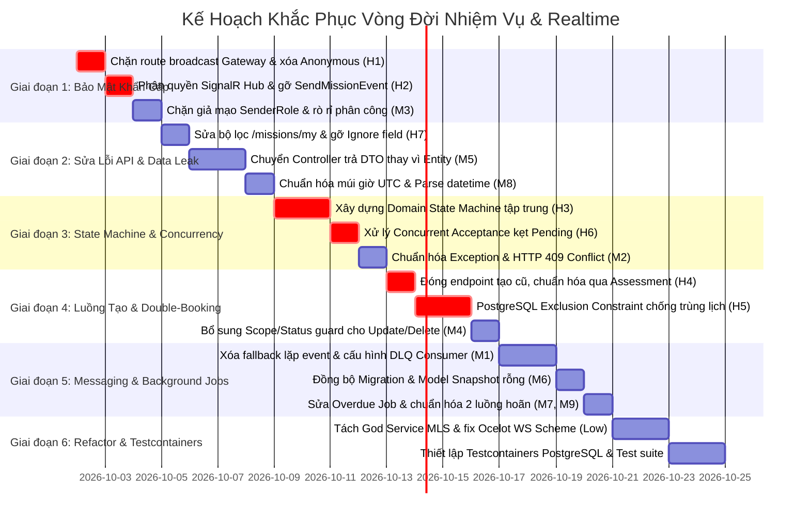

# [ISSUE-AUDIT-001] Báo Cáo Thẩm Định Lỗ Hổng & Kế Hoạch Khắc Phục Toàn Diện Vòng Đời Nhiệm Vụ (Mission Lifecycle) và Realtime Broadcast

- **Trạng thái**: Mở (Open) - Cần thực thi theo kế hoạch
- **Mức độ ưu tiên**: 🔴 Khẩn cấp (P0 / Critical - Ảnh hưởng bảo mật, toàn vẹn dữ liệu và xung đột đồng thời)
- **Phân hệ**: OperationsService, NotificationService, ApiGateway, AIInspectionService, IdentityService, Shared Contracts
- **Tài liệu quy chuẩn tham chiếu**:
  - `docs/requirements/mainflows/MF01.md`
  - `docs/requirements/mainflows/MF02_v2.0_Create_Assign_Inspection_Mission.md`
  - `docs/BACKEND_SPEC_LINEAR_WORKFLOW_AND_APIS_MF02.md`
  - `docs/issues/ISSUE-MF02-LINEAR-WORKFLOW-AND-BACKEND-APIS.md`
  - `docs/issues/ISSUE-MF02-PRIORITY-AND-SCHEDULING-RULES.md`

---

## 1. Kết Quả Thẩm Định Hiện Trạng (Audit Verification Results)

Sau khi rà soát toàn bộ source code thực tế tại commit hiện tại, **100% các vấn đề được liệt kê đều ĐANG TỒN TẠI** trong hệ thống. Cụ thể:

| Mã | Nhóm lỗi | Vị trí file & Dòng code | Trạng thái thẩm định | Hậu quả thực tế |
| :--- | :--- | :--- | :--- | :--- |
| **H1** | Giả mạo sự kiện realtime | `RealtimeMissionBroadcastController.cs:38`<br>`ocelot.json:104` | ❌ **Còn tồn tại** | Bất kỳ ai từ Internet cũng có thể POST vào Gateway `/api/v1/notifications/realtime/mission-event` để phát tán sự kiện giả mạo (`CANCELLED`, `DISPATCHED`,...). |
| **H2** | SignalR Hub hổng quyền | `NotificationHub.cs:88-99, 114-140` | ❌ **Còn tồn tại** | Mọi client đều có thể gọi `JoinMissionGroup(missionId)` để nghe lén chat/lệnh bay, và gọi `SendMissionEvent` để tự ý đổi trạng thái phòng. |
| **H3** | State Machine bị thủng | `MissionLifecycleService.cs:611, 684, 753, 827`<br>`Mission.cs:88, 110` | ❌ **Còn tồn tại** | `Confirm`, `Suspend`, `Resume`, `Postpone` gán trạng thái trực tiếp; `RecalculateReadiness` ghi đè trạng thái; `Cancel()` ném `InvalidOperationException` (HTTP 500) khi mission bị hoãn. |
| **H4** | Tạo mission bỏ qua spec | `MissionController.cs:40-93`<br>`MissionLifecycleService.cs:52-260` | ❌ **Còn tồn tại** | Endpoint `POST /missions` vẫn gọi `_lifecycle.CreateAsync` và `CreateMissionCommand`, không kiểm tra điều kiện đánh giá READY (BR01), không tạo `ResourceBookings`, gán `Guid.Empty` vào FK. |
| **H5** | Đặt trùng tài nguyên (Double-booking) | `PreMissionAssessmentService.cs:474-500`<br>`MissionLifecycleService.cs:454-463` | ❌ **Còn tồn tại** | Kiểm tra xung đột trước khi insert nhưng không có lock (`FOR UPDATE`) hay constraint Postgres (`btree_gist`); `AssignDroneAsync` bỏ qua khung giờ và không tạo booking. |
| **H6** | Kẹt trạng thái PendingAcceptance | `MissionLifecycleService.cs:507-555`<br>`Mission.cs:95-105` | ❌ **Còn tồn tại** | Chấp nhận phân công chỉ tăng `assignment.Version` mà không lock/version `mission`; 2 người accept đồng thời sẽ không ai kích hoạt auto-confirm, mission bị kẹt vĩnh viễn. |
| **H7** | Lỗi truy vấn `/missions/my` & rò rỉ dữ liệu | `MissionRepository.cs:96`<br>`GetMyMissionsQueryHandler.cs:31-76`<br>`AIInspectionService/MissionRepository.cs:50` | ❌ **Còn tồn tại** | Bộ lọc dùng `Assignments.Any(a => a.UserId == userId)` nên trả về cả assignment đã bị thu hồi (`Revoked`); AIInspection và Identity service vẫn còn dính cấu hình `AssignedToUserId` bị Ignore. |
| **M1** | Thiếu Outbox, lặp event & Poison message | `MissionRealtimeNotifier.cs:39, 54`<br>`PreMissionAssessmentService.cs:595`<br>`*Consumer.cs (NotificationService)` | ❌ **Còn tồn tại** | Notifier luôn bắn cả RabbitMQ lẫn HTTP trực tiếp làm client nhận 2 lần; Outbox `MissionCreatedFromAssessment` không có worker xử lý; consumer gọi `BasicNack(requeue: true)` làm treo hàng đợi. |
| **M2** | Nuốt mã lỗi nghiệp vụ, sai HTTP status | `GlobalExceptionHandler.cs:81-91` | ❌ **Còn tồn tại** | Mọi `BusinessRuleException` đều bị ép thành HTTP 400 với mã cố định `"BUSINESS_RULE_VIOLATION"`, mất domain code; lỗi xung đột version/state không trả về 409 Conflict. |
| **M3** | Rò rỉ thông tin & Giả mạo vai trò | `MissionLifecycleService.cs:1472-1478, 1536, 1664` | ❌ **Còn tồn tại** | `GetAssignmentsOverviewAsync` không kiểm tra quyền; Analyst có quyền đọc mọi mission; `AddActivityAsync` lấy `SenderRole` từ request body cho phép giả mạo Manager. |
| **M4** | Update/Delete không kiểm tra quyền & trạng thái | `DeleteMissionCommandHandler.cs:20-27`<br>`UpdateMissionCommandHandler.cs:30-47` | ❌ **Còn tồn tại** | Bất kỳ ai cũng có thể gọi xóa hoặc sửa nhiệm vụ đang bay (`InProgress`), không kiểm tra scope vùng miền hay vai trò quản lý. |
| **M5** | Controller trả trực tiếp Entity EF Core | `MissionController.cs:128, 132, 140, 164, 173...` | ❌ **Còn tồn tại** | Các endpoint trả thẳng `Mission`, `MissionAssignment`, `DroneHandover`... gây nguy cơ lỗi vòng lặp tham chiếu JSON (ObjectCycle / Self-referencing loop). |
| **M6** | Migration lệch Model Snapshot | `ApplicationDbContextModelSnapshot.cs`<br>`20260921040000_AddMissionRealtimeAndCommunicationLogs.Designer.cs` | ❌ **Còn tồn tại** | File Designer của migration 0921 hoàn toàn rỗng; Snapshot thiếu `ConfirmationDeadline`, `MissionCommunicationLogs`. |
| **M7** | Lỗi logic quét quá hạn | `MissionConfirmationOverdueJob.cs:45, 115-125` | ❌ **Còn tồn tại** | Quét cả mission `Draft`; phát SignalR trước khi gọi `db.SaveChangesAsync()`; ghi trực tiếp vào DB mà không có kiểm soát đồng thời. |
| **M8** | Lệch múi giờ & định dạng UTC | `MissionController.cs:355`<br>`MissionLifecycleService.cs:1680` | ❌ **Còn tồn tại** | `DateTime.SpecifyKind` làm sai lệch mốc giờ của local time; thông báo in giờ UTC mà không có nhãn timezone khiến phi công hiểu nhầm là giờ GMT+7. |
| **M9** | Hardcode tiêu đề & Xung đột 2 API hoãn | `MissionLifecycleService.cs:1692`<br>`MissionController.cs:143, 194` | ❌ **Còn tồn tại** | Tiêu đề thông báo luôn bị ép thành "Yêu cầu xác nhận nhiệm vụ"; tồn tại 2 API hoãn (`/assignments/postpone` vs `/postpone`) với 2 hành vi state khác nhau. |
| **Low** | God Service, magic code & gateway ws | Toàn hệ thống | ❌ **Còn tồn tại** | `MissionLifecycleService` dài 1.711 dòng; `new Random()` sinh mã ticket; Ocelot route dùng `http` thay vì `ws` làm hỏng WebSocket upgrade. |
| **Test** | Lỗ hổng kiểm thử tự động | Các project `*.Tests` | ❌ **Còn tồn tại** | 100% test dùng `UseInMemoryDatabase`, không phát hiện được lỗi FK, Unique, Timestamp Npgsql, hay lỗi đồng thời. |

---

## 2. Chi Tiết Kỹ Thuật Từng Vấn Đề

### 🔴 Nhóm Nghiêm Trọng (High - P0)

#### H1. Giả mạo sự kiện Realtime qua API Gateway
* **Hiện trạng**: 
  - `RealtimeMissionBroadcastController.cs:38` đánh dấu `[AllowAnonymous]` với chú thích "Internal communication".
  - `ocelot.json:104` cấu hình định tuyến upstream `/api/v{version}/notifications/{everything}` thẳng vào NotificationService mà không bật `AuthenticationOptions`.
* **Rủi ro**: Kẻ tấn công bên ngoài có thể gửi POST payload JSON giả mạo `Type: "CANCELLED"` hoặc `Status: "DISPATCHED"` làm sai lệch toàn bộ trạng thái hiển thị trên dashboard của toàn bộ phi công và điều hành viên.
* **Giải pháp**:
  - Gỡ bỏ `[AllowAnonymous]`. Yêu cầu xác thực Bearer token hoặc Internal Secret Header (`X-Internal-Service-Key`).
  - Trong `ocelot.json`, chặn hoặc loại trừ đường dẫn `/api/v*/notifications/realtime/**` khỏi upstream công khai.
  - Tối ưu nhất: Bỏ hoàn toàn endpoint HTTP này, chỉ phát sự kiện qua RabbitMQ Event Bus.

#### H2. SignalR NotificationHub hổng phân quyền
* **Hiện trạng**:
  - `NotificationHub.cs:88`: Hàm `JoinMissionGroup(string missionId)` nhận ID tùy ý từ client và gọi `Groups.AddToGroupAsync` mà không kiểm tra xem user hiện tại có được phân công, có quyền quản lý hay có phạm vi địa lý đối với nhiệm vụ đó hay không.
  - `NotificationHub.cs:114`: Hàm `SendMissionEvent(...)` là public method trên Hub, cho phép bất kỳ client SignalR nào gọi invoke để broadcast sự kiện vòng đời nhiệm vụ đến toàn bộ người trong phòng.
* **Rủi ro**: Rò rỉ toàn bộ nội dung chỉ thị điều hành, lý do hoãn, tin nhắn nội bộ; client có thể tự kích hoạt sự kiện vòng đời giả mạo.
* **Giải pháp**:
  - Xóa bỏ hoàn toàn phương thức `SendMissionEvent` khỏi `NotificationHub` (chỉ cho phép server-side phát sự kiện thông qua `IHubContext<NotificationHub>`).
  - Trong `JoinMissionGroup`, inject service kiểm tra quyền truy cập nhiệm vụ (`IMissionRepository.UserCanAccessAsync`) trước khi cho phép add vào group.

#### H3. State Machine bị thủng, không nhất quán
* **Hiện trạng**:
  - `MissionLifecycleService.ConfirmMissionAsync` (dòng 611): Gán cứng `mission.Status = MissionStatus.Assigned` bất kể trạng thái trước đó là gì.
  - `SuspendMissionAsync` (dòng 684), `ResumeMissionAsync` (dòng 753), `PostponeMissionAsync` (dòng 827) không hề kiểm tra trạng thái hợp lệ trước khi chuyển.
  - `Mission.RecalculateReadiness()` (dòng 110): Chỉ kiểm tra `Cancelled`, `Completed`, `InProgress`, `PendingAcceptance`. Nếu mission đang `Suspended` hoặc `Postponed`, hàm này vẫn chạy và tự động đổi trạng thái sang `Ready` hoặc `Assigned`!
  - `Mission.Cancel()` (dòng 88): Danh sách cho phép hủy chỉ có `Draft`, `PendingAcceptance`, `Assigned`, `Preparing`, `Ready`. Trạng thái `Postponed` và `Suspended` bị loại trừ, dẫn đến ném `InvalidOperationException` (gây lỗi HTTP 500 khi người dùng muốn hủy một nhiệm vụ đã bị hoãn).
* **Giải pháp**:
  - Xây dựng một bảng ma trận chuyển đổi trạng thái duy nhất (`MissionStateMachine` hoặc Domain Rule Matrix).
  - Mọi thao tác thay đổi trạng thái đều phải thông qua hàm domain method (ví dụ: `mission.Confirm()`, `mission.Suspend()`, `mission.Resume()`, `mission.Postpone()`).
  - Nếu chuyển trạng thái không hợp lệ, ném `InvalidStateTransitionException` và GlobalExceptionHandler map thành HTTP 409 Conflict với mã lỗi `INVALID_MISSION_STATE`.
  - Cập nhật `RecalculateReadiness()` bỏ qua cả `Suspended` và `Postponed`. Cho phép `Cancel()` từ trạng thái `Postponed` và `Suspended`.

#### H4. Tồn tại luồng tạo mission bỏ qua đặc tả (Bypass Assessment & Specs)
* **Hiện trạng**:
  - `MissionController.cs:53-74`: Endpoint `POST /api/v1/missions` vẫn chấp nhận payload và gọi `_lifecycle.CreateAsync` hoặc `CreateMissionCommandHandler`.
  - Luồng này không yêu cầu Pre-Mission Assessment phải đạt trạng thái `READY` (vi phạm quy tắc BR01).
  - Không kiểm tra tính hợp lệ của Drone/Inspector theo quy chuẩn V11–V18 và hoàn toàn không tạo bản ghi giữ chỗ trong `ResourceBookings`.
  - Nếu thiếu inspector, code gán `Guid.Empty` vào cột `AssignedToUserId` (cột foreign key có ràng buộc NOT NULL trong CSDL Postgres), gây crash 500 khi lưu.
* **Giải pháp**:
  - Đóng vĩnh viễn endpoint tạo mission cũ trong `MissionController`.
  - Quy định luồng duy nhất để tạo Mission là thông qua `PreMissionAssessmentV2Controller` (`POST /api/v2/pre-mission-assessments/{id}/create-mission`).
  - Xóa bỏ hoặc deprecate `CreateMissionCommandHandler` và `MissionLifecycleService.CreateAsync`.

#### H5. Đặt trùng tài nguyên (Double-booking) do thiếu cơ chế khóa
* **Hiện trạng**:
  - `PreMissionAssessmentService.cs:474-500`: Kiểm tra xung đột bằng câu lệnh `_db.ResourceBookings.Where(...).ToListAsync()` rồi mới thực hiện `_db.ResourceBookings.Add(...)`.
  - Giữa thời điểm đọc và ghi không hề có khóa dữ liệu (Row-level Lock hoặc Database Constraint). Nếu 2 quản lý cùng bấm tạo nhiệm vụ cho cùng 1 drone tại cùng khung giờ, cả 2 lệnh SELECT đều trả về 0 xung đột, và cả 2 đều ghi thành công!
  - `AssignDroneAsync` (MLS dòng 454) kiểm tra trùng lặp drone toàn thời gian mà không xét khung giờ, đồng thời không ghi bản ghi nào vào bảng `ResourceBookings`.
* **Giải pháp**:
  - Thêm PostgreSQL Exclusion Constraint trên bảng `ResourceBookings` sử dụng extension `btree_gist`:
    ```sql
    ALTER TABLE "ResourceBookings" ADD CONSTRAINT "no_overlapping_drone_bookings"
    EXCLUDE USING gist (
        "DroneId" WITH =,
        tsrange("StartAt", "EndAt") WITH &&
    ) WHERE ("Status" = 1); -- Active
    ```
  - Hoặc trong transaction của application, thực hiện locking tài nguyên trước khi kiểm tra và insert.
  - Viết lại `AssignDroneAsync` để kiểm tra theo khung giờ và insert bản ghi vào `ResourceBookings`.

#### H6. Kẹt trạng thái PendingAcceptance khi chấp nhận đồng thời
* **Hiện trạng**:
  - `AcceptAssignmentAsync` (MLS:519): Khi phi công bấm nhận việc, code cập nhật `assignment.ResponseStatus = Accepted` và tăng `assignment.Version++`, nhưng KHÔNG tăng `mission.Version` và KHÔNG khóa dòng `Missions`.
  - Khi 2 phi công/thanh tra bấm nhận việc cùng thời điểm: Cả 2 luồng đọc dữ liệu từ DB (mỗi luồng thấy người kia đang `Pending`).
  - Cả 2 luồng đều kiểm tra `mission.CheckAcceptance()` ra kết quả `false` (vì trong context bộ nhớ của mỗi luồng, người kia chưa accept).
  - Cả 2 luồng đều commit thành công vì cập nhật 2 dòng `MissionAssignment` khác nhau (không xảy ra xung đột concurrency của EF Core).
  - **Kết quả**: Cả 2 bản ghi assignment trong DB đều là `Accepted`, nhưng `mission.Status` vẫn mãi mãi là `PendingAcceptance`!
* **Giải pháp**:
  - Bắt buộc tăng `mission.Version++` và cập nhật dòng `Missions` trong cùng một transaction khi xử lý `AcceptAssignmentAsync`.
  - Hoặc sử dụng cơ chế reload/re-evaluate với khóa lạc quan (Optimistic Concurrency) trên `Mission`: Nếu phát hiện nhiệm vụ đang ở `PendingAcceptance`, kiểm tra lại điều kiện hoàn tất tiếp nhận trên cơ sở dữ liệu trước khi hoàn tất commit.

#### H7. Lỗi truy vấn `/missions/my` và rò rỉ phân công đã thu hồi
* **Hiện trạng**:
  - `MissionRepository.cs:96`: Truy vấn lọc lấy nhiệm vụ của tôi dùng:
    ```csharp
    Where(m => (m.InspectorId.HasValue && m.InspectorId.Value == userId) || m.Assignments.Any(a => a.UserId == userId) || m.ManagerId == userId)
    ```
    Biểu thức `m.Assignments.Any(a => a.UserId == userId)` KHÔNG kiểm tra trạng thái phân công, khiến các phân công đã bị thu hồi (`Status == MissionAssignmentStatus.Revoked`) vẫn hiển thị trên danh sách của người dùng.
  - Trong `AIInspectionService` và `IdentityService`, các `MissionRepository.cs` vẫn đang chứa đoạn mã `.Include(m => m.AssignedToUser)` và lọc theo `AssignedToUserId` (những trường đã bị EF Core Ignore trong model configuration).
* **Giải pháp**:
  - Cập nhật điều kiện lọc trong `MissionRepository.cs`:
    ```csharp
    m.Assignments.Any(a => a.UserId == userId && a.Status == MissionAssignmentStatus.Active)
    ```
  - Đồng bộ hóa các Repository trên AIInspectionService và IdentityService để loại bỏ hoàn toàn các trường bị Ignore.
  - Bổ sung phân trang (`page`, `pageSize`) và `AsNoTracking()` cho endpoint `/missions/my`.

---

### 🟡 Nhóm Mức Độ Trung Bình (Medium - P1)

#### M1. Xử lý Messaging và Outbox
* `MissionRealtimeNotifier.NotifyAsync` đang chạy tuần tự: Bước 1 Publish qua Event Bus, sau đó Bước 2 luôn gọi HTTP trực tiếp tới NotificationService. Cần chuyển HTTP thành fallback nằm trong khối `catch` khi publish Event Bus thất bại, hoặc bỏ hẳn HTTP và chỉ dùng RabbitMQ.
* `PreMissionAssessmentService.cs:595` ghi bản ghi Outbox với `MessageType = "MissionCreatedFromAssessment"`, nhưng không có bất kỳ background worker nào quét và xử lý message type này. Cần bổ sung handler hoặc gỡ bỏ nếu không cần thiết.
* 5 Consumer trong NotificationService (`DefectDetectedConsumer`, `MissionLifecycleRealtimeConsumer`, `MissionCreatedConsumer`, `AIAnalysisStatusChangedConsumer`, `NotificationPushConsumer`) đều gọi `BasicNackAsync(..., requeue: true)`. Khi gặp lỗi dữ liệu (poison message), message bị đẩy lại queue và crash vô tận. Cần chuyển sang `requeue: false` và định tuyến sang Dead Letter Queue (DLQ).

#### M2. Chuẩn hóa Mã Lỗi và HTTP Status Code
* `GlobalExceptionHandler.cs:81-91` ép toàn bộ `BusinessRuleException` thành HTTP 400 Bad Request và gán mã cứng `"BUSINESS_RULE_VIOLATION"`, làm mất các mã lỗi quan trọng như `RESOURCE_BOOKING_CONFLICT`, `ASSESSMENT_EXPIRED_OR_NOT_READY`.
* Cần cập nhật `ApiResponse` để giữ nguyên thuộc tính `ErrorCode` từ `BusinessRuleException.Code`.
* Các lỗi xung đột dữ liệu đồng thời (`DbUpdateConcurrencyException`, `ASSESSMENT_CONCURRENCY_CONFLICT`, `INVALID_MISSION_STATE`) phải trả về **HTTP 409 Conflict**.

#### M3. Phân quyền và Chống Giả mạo Vai trò
* `GetAssignmentsOverviewAsync` (MLS:1536): Bổ sung kiểm tra quyền truy cập (`AccessibleMission`) thay vì cho phép mọi user đã đăng nhập đều xem được ma trận phân công của nhiệm vụ bất kỳ.
* `AccessibleMission` (MLS:1664): Loại bỏ quyền bypass toàn cầu của role `Analyst` đối với mọi nhiệm vụ bay. Analyst chỉ được xem các nhiệm vụ có hình ảnh/khuyết tật thuộc phạm vi phân tích của họ.
* `AddActivityAsync` (MLS:1472): Tuyệt đối không tin `request.SenderRole` từ client gửi lên. Vai trò phải được trích xuất trực tiếp từ Claims của `ICurrentUserServices` và phân công thực tế trong nhiệm vụ.

#### M4. Kiểm soát Quyền và Trạng thái cho Update & Delete
* `DeleteMissionCommandHandler.cs`: Kiểm tra quyền quản lý vùng (`RequireManageMission`) và cấm xóa nhiệm vụ nếu trạng thái khác `Draft`.
* `UpdateMissionCommandHandler.cs`: Bổ sung kiểm tra quyền của người gọi (chỉ Manager được phân công quản lý vùng mới có quyền sửa tiêu đề, mô tả).

#### M5. Trả về DTO thay vì Entity EF Core
* Tại `MissionController.cs`, thay thế toàn bộ các kết quả trả về là Entity (`Mission`, `MissionAssignment`, `MissionCommunicationLog`, `DroneHandover`) bằng các DTO tinh gọn (`MissionDto`, `MissionAssignmentDto`, `MissionCommunicationLogDto`). Điều này ngăn chặn lỗi serialize JSON lặp vô tận và bảo vệ cấu trúc database nội bộ.

#### M6. Đồng bộ hóa Migration và Model Snapshot
* Chạy lệnh tạo migration chuẩn để cập nhật `ApplicationDbContextModelSnapshot.cs`, đưa các bảng và cột còn thiếu (`ConfirmationDeadline`, `MissionCommunicationLogs`,...) vào snapshot.
* Tái tạo file Designer cho migration `20260921040000_AddMissionRealtimeAndCommunicationLogs`.

#### M7. Sửa Job Quét Quá Hạn Tiếp Nhận (`MissionConfirmationOverdueJob`)
* Bỏ trạng thái `"Draft"` khỏi điều kiện quét quá hạn (dòng 45). Nhiệm vụ Draft chưa ban hành thì không thể tính là quá hạn xác nhận.
* Di chuyển lệnh phát SignalR (`SendAsync`) xuống SAU khi `await db.SaveChangesAsync()` thành công.
* Thêm kiểm tra Version hoặc cờ xử lý nguyên tử để tránh xung đột với OperationsService.

#### M8. Chuẩn hóa Thời gian và Múi giờ
* Loại bỏ `DateTime.SpecifyKind` không an toàn. Mọi chuỗi ngày tháng gửi lên từ FE phải được parse chính xác sang UTC (`DateTimeOffset.ToUniversalTime()`).
* Mọi thông báo hiển thị cho người dùng phải có nhãn múi giờ rõ ràng (ví dụ: `HH:mm dd/MM/yyyy (Giờ Việt Nam / GMT+7)`).

#### M9. Đồng nhất Thông báo & Gom 2 API Hoãn
* Viết hàm sinh tiêu đề và nội dung thông báo linh hoạt dựa trên `type` (`MISSION_CANCELLED` -> "Nhiệm vụ đã bị hủy", `MISSION_SUSPENDED` -> "Lệnh tạm đình chỉ bay khẩn cấp",...).
* Thống nhất luồng hoãn: Định nghĩa rõ ràng sự khác biệt giữa "Phi công xin hoãn lịch phân công" (`postpone-assignment`) và "Quản lý quyết định hoãn toàn bộ nhiệm vụ" (`postpone-mission`).

---

### 🟢 Nhóm Cải Tiến Kiến Trúc & Kiểm Thử (Low & Testing)

1. **Tách God Service `MissionLifecycleService` (1.711 dòng)**:
   - Tách thành các service chuyên biệt: `MissionAcceptanceService` (xử lý chấp nhận/hoãn của nhân sự), `ResourceConflictService` (xử lý đặt chỗ và kiểm tra trùng lịch), `MissionStateService` (xử lý chuyển đổi trạng thái), và `MissionRealtimePublisher` (xử lý phát sự kiện).
2. **Loại bỏ Code Chết & Chuẩn hóa Magic Strings**:
   - Xóa bỏ `CancelAsync` (MLS:585).
   - Đưa toàn bộ chuỗi trạng thái thành Enum hoặc `static class` hằng số duy nhất.
   - Thay thế `new Random()` bằng `RandomNumberGenerator` hoặc sequence DB để sinh mã ticket an toàn.
   - Sinh `MissionCode` kết hợp sequence hoặc GUID ngắn để chống trùng mã khi tạo đồng thời.
3. **Cấu hình Gateway cho WebSocket**:
   - Trong `ocelot.json`, cấu hình route `/hubs/notifications/{everything}` với Downstream Scheme là `ws` hoặc cấu hình WebSockets chuyên dụng của Ocelot để SignalR bắt tay thành công qua WebSocket thay vì bị tụt xuống Server-Sent Events / Long Polling.
4. **Nâng cấp Kiểm thử (Integration Testing với Testcontainers)**:
   - Bổ sung project kiểm thử tích hợp sử dụng `Testcontainers.PostgreSql`.
   - Viết test case chạy trên PostgreSQL thật để bắt các lỗi ràng buộc FK, Unique Index, Exclusion Constraint và timezone UTC của Npgsql.
   - Viết unit test cho các luồng chuyển trạng thái không hợp lệ, phân quyền SignalR Hub, và xử lý đồng thời (Concurrent Accepts/Bookings).

---

## 3. Kế Hoạch Triển Khai Chi Tiết (Implementation Plan)



### Chi Tiết Từng Giai Đoạn

#### 🔹 Giai đoạn 1: Khắc phục Lỗ hổng Bảo mật Khẩn cấp (Ưu tiên số 1)
1. **Khắc phục H1**:
   - `RealtimeMissionBroadcastController.cs`: Gỡ bỏ `[AllowAnonymous]`, thêm xác thực internal token header hoặc xóa bỏ endpoint này nếu không cần thiết.
   - `ocelot.json`: Xóa route catch-all công khai vào `/notifications/realtime/**`.
2. **Khắc phục H2**:
   - `NotificationHub.cs`: Xóa bỏ hàm `SendMissionEvent`.
   - Bổ sung xác thực kiểm tra quyền truy cập của user đối với `missionId` trong `JoinMissionGroup`.
3. **Khắc phục M3**:
   - `AddActivityAsync`: Lấy role từ Token Claims, cấm nhận `SenderRole` từ request body.
   - `GetAssignmentsOverviewAsync`: Gọi `AccessibleMission` để kiểm tra quyền trước khi trả kết quả.
   - `AccessibleMission`: Giới hạn phạm vi truy cập của vai trò Analyst.

#### 🔹 Giai đoạn 2: Sửa các Lỗi API Đang Gặp Phải & Rò Rỉ Dữ liệu
1. **Khắc phục H7**:
   - `MissionRepository.cs`: Thêm điều kiện `a.Status == MissionAssignmentStatus.Active` khi lọc nhiệm vụ được giao.
   - Dọn dẹp các repository ở `AIInspectionService` và `IdentityService` để loại bỏ các tham chiếu đến thuộc tính bị ignore.
2. **Khắc phục M5**:
   - Tạo các DTO phản hồi: `MissionActionResponseDto`, `MissionSummaryDto`...
   - Cập nhật các action trong `MissionController` để map từ Entity sang DTO trước khi trả về `ApiResponse`.
3. **Khắc phục M8**:
   - Kiểm tra và chuẩn hóa toàn bộ hàm parse thời gian sang UTC chuẩn.
   - Bổ sung format múi giờ rõ ràng trong các template thông báo.

#### 🔹 Giai đoạn 3: Chuẩn hóa State Machine & Xử lý Đồng thời
1. **Khắc phục H3**:
   - Thiết kế `MissionStateMachine` với các quy tắc chuyển trạng thái hợp lệ.
   - Cập nhật các method trong `Mission.cs` (`Confirm()`, `Suspend()`, `Resume()`, `Postpone()`, `Cancel()`).
   - Cập nhật `RecalculateReadiness()` không làm sai lệch trạng thái `Suspended` và `Postponed`.
2. **Khắc phục H6**:
   - Trong `AcceptAssignmentAsync`, cập nhật `mission.Version++` và bắt buộc lưu đồng thời cả `Mission` lẫn `MissionAssignment`.
   - Bổ sung lock hoặc re-query trạng thái chấp nhận trong transaction để kích hoạt auto-confirm chính xác.
3. **Khắc phục M2**:
   - Sửa `GlobalExceptionHandler` để giữ nguyên domain `ErrorCode`.
   - Trả về HTTP 409 Conflict cho các lỗi xung đột trạng thái và concurrency.

#### 🔹 Giai đoạn 4: Dọn dẹp Luồng Tạo Nhiệm Vụ & Chống Double-Booking
1. **Khắc phục H4**:
   - Đánh dấu deprecated và chặn gọi `POST /api/v1/missions` trực tiếp. Chuyển hướng toàn bộ sang `PreMissionAssessmentV2Controller.CreateMissionFromAssessment`.
   - Xóa bỏ `CreateMissionCommandHandler` cũ.
2. **Khắc phục H5**:
   - Viết migration bổ sung `btree_gist` extension và Exclusion Constraint trên bảng `ResourceBookings`.
   - Chuẩn hóa `AssignDroneAsync` để tôn trọng khung giờ và insert booking hợp lệ.
3. **Khắc phục M4**:
   - Thêm kiểm tra quyền sở hữu vùng và trạng thái `Draft` trong `DeleteMissionCommandHandler` và `UpdateMissionCommandHandler`.

#### 🔹 Giai đoạn 5: Tối ưu Messaging, Background Jobs & Database Migration
1. **Khắc phục M1**:
   - Sửa `MissionRealtimeNotifier.cs` chỉ gọi fallback khi publish RabbitMQ thất bại.
   - Cấu hình Dead Letter Queue (DLQ) cho các consumer của NotificationService, đổi `requeue: true` thành `requeue: false`.
2. **Khắc phục M6**:
   - Tạo migration bổ sung để đồng bộ hoàn toàn `ApplicationDbContextModelSnapshot`.
3. **Khắc phục M7 & M9**:
   - Sửa `MissionConfirmationOverdueJob` loại bỏ trạng thái `Draft` và đảm bảo commit DB trước khi phát realtime.
   - Thống nhất các API hoãn và sinh tiêu đề thông báo theo đúng ngữ cảnh sự kiện.

#### 🔹 Giai đoạn 6: Tái cấu trúc Kiến trúc & Nâng cao Năng lực Kiểm thử
1. **Giải quyết Low**:
   - Tách `MissionLifecycleService` thành các service đơn nhiệm.
   - Sửa route `ocelot.json` sang `ws` để hỗ trợ native WebSocket upgrade.
   - Dùng `RandomNumberGenerator` và sequence chống trùng lặp mã.
2. **Nâng cấp Testing**:
   - Tích hợp `Testcontainers.PostgreSql` vào test suite của OperationsService.
   - Viết integration test bao phủ: Đăng ký trùng lịch đồng thời (Race condition double booking), Chấp nhận nhiệm vụ đồng thời (Concurrent acceptance), và Chuyển trạng thái phi pháp.

---

## 4. Tiêu Chuẩn Nghiệm Thu (Acceptance Criteria)

- [x] **Bảo mật**: Không thể kích hoạt sự kiện realtime từ ngoài Gateway nếu không có internal auth; không thể join phòng SignalR của nhiệm vụ ngoài phạm vi quyền hạn; không thể spoof `SenderRole: MANAGER`.
- [x] **State Machine**: Chuyển trạng thái sai quy tắc trả về HTTP 409 `INVALID_MISSION_STATE`. Nhiệm vụ bị hoãn (`Postponed`) hoặc tạm dừng (`Suspended`) có thể hủy hợp lệ mà không phát sinh lỗi 500.
- [x] **Tính toàn vẹn tài nguyên**: Hai request đặt trùng drone hoặc thanh tra trong cùng khung giờ thì request thứ hai bắt buộc phải bị từ chối bởi database exclusion constraint (HTTP 409).
- [x] **Tiếp nhận đồng thời**: Khi tất cả các vai trò bắt buộc bấm Accept đồng thời, nhiệm vụ chắc chắn chuyển sang `Assigned` (`CONFIRMED`) và broadcast sự kiện realtime thành công mà không bị kẹt ở `PendingAcceptance`.
- [x] **API Query**: Endpoint `/missions/my` trả về đúng danh sách phân công đang hoạt động (`Active`), loại bỏ toàn bộ phân công đã bị thu hồi (`Revoked`), dữ liệu trả về thông qua DTO không bị lỗi vòng lặp tham chiếu.
- [x] **Messaging**: Mỗi sự kiện chỉ được gửi đến client 1 lần duy nhất; poison message được cách ly vào DLQ mà không làm treo worker; snapshot database khớp 100% với model thực tế.
