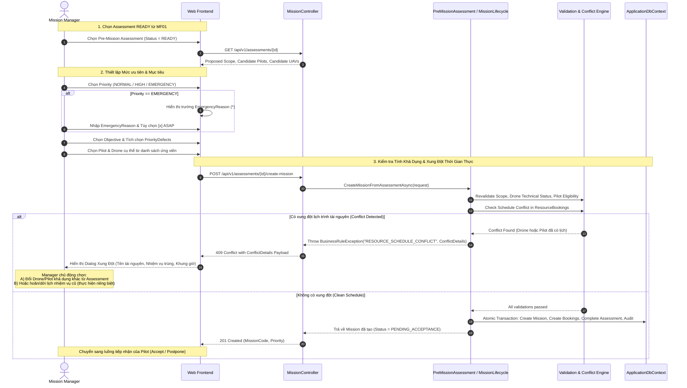

# [ISSUE-MF02-002] Mở Rộng MF02 – Mức Độ Ưu Tiên Nhiệm Vụ & Quy Tắc Lập Lịch Bay (Mission Priority & Scheduling Rules)

- **Trạng thái**: Đang triển khai (In Progress)
- **Mức độ ưu tiên**: 🔴 Cao (P1 / High - Quy định thứ tự điều phối và an toàn bay)
- **Phân hệ**: OperationsService / ApiGateway
- **Tác giả / Người phụ trách**: Johnhandsome
- **Tài liệu tham chiếu**:
  - `docs/requirements/mainflows/MF01_v2.0_PreMission_Feasibility_Resource_Readiness.md`
  - `docs/requirements/mainflows/MF02_v2.0_Create_Assign_Inspection_Mission.md`
  - `docs/issues/ISSUE-MF02-LINEAR-WORKFLOW-AND-BACKEND-APIS.md`

---

## 1. Bối Cảnh & Mục Tiêu Nghiệp Vụ (Context & Business Objectives)

Trong quy trình vận hành và kiểm tra lưới điện truyền tải bằng UAV, các nhiệm vụ bay có mức độ khẩn cấp và mục đích kiểm tra rất khác nhau: từ kiểm tra định kỳ hàng tháng, tái kiểm tra các điểm có nguy cơ, cho đến điều tra sự cố lưới điện khẩn cấp (như đứt dây dẫn, nứt vỡ cách điện, cháy nổ hành lang tuyến).

Nhằm hỗ trợ **Mission Manager (Người quản lý nhiệm vụ)** ra quyết định điều phối chính xác và tối ưu, luồng chính **MF02 (Create & Assign Inspection Mission)** cần được mở rộng với các mục tiêu:
1. **Phân cấp thứ tự ưu tiên (Mission Ordering)**: Hệ thống phải tự động sắp xếp danh sách nhiệm vụ theo mức độ ưu tiên và thời gian lập lịch, giúp nhận diện ngay nhiệm vụ nào cần được thực hiện trước.
2. **Lập kế hoạch theo mức ưu tiên (Priority-based Planning)**: Phân tách rõ ràng giữa *Mức độ ưu tiên* (`Priority`) và *Mục tiêu kiểm tra* (`InspectionObjective`), cho phép cấu hình linh hoạt mục tiêu và danh mục khuyết tật trọng tâm (`PriorityDefects`).
3. **Quy trình kiểm tra khẩn cấp (Emergency Inspection Handling)**: Hỗ trợ tạo nhiệm vụ khẩn cấp (`EMERGENCY`) với yêu cầu giải trình lý do (`EmergencyReason`) và tùy chọn cờ thực hiện ngay (`IsImmediate` / ASAP).
4. **Minh bạch xung đột tài nguyên (Resource Conflict Visibility)**: Cung cấp cơ chế cảnh báo rõ ràng khi tài nguyên (UAV / Phi công) bị trùng lịch, tuyệt đối tuân thủ nguyên tắc **không tự động chiếm dụng (No Automatic Preemption)** và **không bỏ qua an toàn bay (Emergency Safety Guarantee)**.

---

## 2. Thiết Kế Miền & Mô Hình Dữ Liệu (Domain Modeling & Data Contracts)

### 2.1. Các Enums Nghiệp Vụ Mới

Tạo tại: `Services/OperationsService/UavPms.OperationsService.Domain/Enums/MissionPriorityEnums.cs`

```csharp
namespace UavPms.OperationsService.Domain.Enums;

/// <summary>
/// Mức độ ưu tiên của nhiệm vụ bay (BR-01)
/// </summary>
public enum MissionPriority
{
    Normal = 0,      // Thường: Kiểm tra định kỳ, tái kiểm tra tiêu chuẩn
    High = 1,        // Cao: Tái kiểm tra khuyết tật tái diễn, tài sản cảnh báo sớm
    Emergency = 2    // Khẩn cấp: Báo cáo sự cố lưới điện, nguy cơ an toàn tức thì
}

/// <summary>
/// Mục tiêu kiểm tra của nhiệm vụ (độc lập với mức ưu tiên)
/// </summary>
public enum InspectionObjective
{
    PeriodicInspection = 0,       // Kiểm tra định kỳ đường dây / cột điện
    TargetedReinspection = 1,     // Tái kiểm tra khuyết tật / điểm nghi vấn
    IncidentFollowUp = 2,         // Theo dõi sau sự cố lưới điện
    EmergencyInspection = 3       // Kiểm tra khẩn cấp phục vụ khắc phục sự cố
}

/// <summary>
/// Danh mục khuyết tật trọng tâm cần ưu tiên giám sát (Priority Defects)
/// </summary>
public enum DefectCategory
{
    InsulatorDefect,      // Khuyết tật bát sứ / chuỗi cách điện (vỡ, phóng điện, bẩn)
    ConductorDefect,      // Khuyết tật dây dẫn / dây chống sét (tưa sợi, đứt, quá nhiệt)
    SurgeArresterDefect,  // Khuyết tật chống sét van
    ForeignObject,        // Dị vật / tổ chim / bạt / cây ngã vào hành lang
    TowerCorrosion,       // Rỉ sét thân cột, biến dạng kết cấu thép, lỏng bu lông
    Other
}
```

### 2.2. Mở Rộng Entity `Mission`

Tệp: `Services/OperationsService/UavPms.OperationsService.Domain/Entities/Mission.cs`

Bổ sung các thuộc tính:
- `public MissionPriority Priority { get; set; } = MissionPriority.Normal;`
- `public InspectionObjective Objective { get; set; } = InspectionObjective.PeriodicInspection;`
- `public string PriorityDefectsJson { get; set; } = "[]";` (Lưu danh sách JSON các chuỗi nhóm khuyết tật ưu tiên, ví dụ: `["InsulatorDefect", "ForeignObject"]`)
- `public string? EmergencyReason { get; set; }` (Lý do khẩn cấp - bắt buộc khi `Priority == MissionPriority.Emergency`)
- `public bool IsImmediate { get; set; } = false;` (Cờ đánh dấu thực hiện khẩn cấp ngay / ASAP)

### 2.3. Ràng Buộc Cơ Sở Dữ Liệu & Chỉ Mục (Database Constraints & Indexes)

1. **Check Constraint trên PostgreSQL**:
   ```sql
   ALTER TABLE "Missions" ADD CONSTRAINT "CK_Missions_EmergencyReason"
   CHECK ("Priority" <> 2 OR ("EmergencyReason" IS NOT NULL AND LENGTH(TRIM("EmergencyReason")) > 0));
   ```
2. **Composite Index tối ưu sắp xếp danh sách nhiệm vụ**:
   ```sql
   CREATE INDEX "IX_Missions_Priority_PlannedStart_CreatedAt"
   ON "Missions" ("Priority" DESC, "PlannedStart" ASC NULLS LAST, "CreatedAt" ASC);
   ```

---

## 3. Quy Tắc Nghiệp Vụ Bắt Buộc (Business Rules Specification)

| Mã Quy Tắc | Tên Quy Tắc | Mô Tả Chi Tiết & Ràng Buộc Kỹ Thuật |
| :--- | :--- | :--- |
| **BR-01** | **Priority Levels** | Mức ưu tiên chỉ được phép là một trong ba giá trị: `NORMAL`, `HIGH`, `EMERGENCY`. Giá trị mặc định là `NORMAL`. |
| **BR-02** | **Priority Ordering** | Trong danh sách nhiệm vụ, các nhiệm vụ có mức ưu tiên cao hơn luôn được xếp trước các nhiệm vụ có mức ưu tiên thấp hơn (`EMERGENCY` > `HIGH` > `NORMAL`). |
| **BR-03** | **Same Priority Ordering** | Với các nhiệm vụ cùng mức ưu tiên: <br/>1. Nhiệm vụ có thời gian bắt đầu dự kiến (`PlannedStart` hoặc `ScheduledStartAt`) sớm hơn sẽ được xếp trước.<br/>2. Nếu cùng thời gian bắt đầu, nhiệm vụ được tạo sớm hơn (`CreatedAt` tăng dần) sẽ được xếp trước. |
| **BR-04** | **No Automatic Resource Preemption** | Việc tạo nhiệm vụ `EMERGENCY` **tuyệt đối không** được tự động hủy (cancel), tự động gỡ bỏ (unassign), hoặc tước đoạt UAV / Phi công của bất kỳ nhiệm vụ nào khác đã được lên lịch. |
| **BR-05** | **Emergency Safety Guarantee** | Mức ưu tiên `EMERGENCY` không được phép bỏ qua các điều kiện an toàn bay và kết quả thẩm định MF01: bắt buộc phải có `READY PreMissionAssessment` còn hạn, UAV đạt chuẩn kỹ thuật (`OperationalStatus == Available`, kiểm tra kỹ thuật không quá hạn), và Phi công đủ điều kiện. |
| **BR-06** | **Emergency Reason Mandatory** | Khi `Priority == EMERGENCY`, trường `EmergencyReason` là bắt buộc, không được để trống hoặc chỉ chứa khoảng trắng (tối thiểu 10 ký tự giải trình). |
| **BR-07** | **Real-time Resource Revalidation** | Trước khi tạo hoặc phân công nhiệm vụ, Backend bắt buộc phải kiểm tra lại (revalidate) tính khả dụng thực tế của Phi công và UAV trên bảng `ResourceBookings` tại thời điểm commit, ngăn ngừa xung đột xảy ra sau thời điểm kết thúc MF01. |
| **BR-08** | **Strict Scope Consistency** | Danh sách tài sản (`MissionTargets`) phải thuộc phạm vi đã được MF01 thẩm định. Mọi thay đổi trọng yếu (đổi tuyến đường dây, đổi phân vùng, hoặc bổ sung tài sản ngoài phạm vi) bắt buộc phải tạo lại đánh giá MF01 mới (`409 REASSESSMENT_REQUIRED`). |
| **BR-09** | **Priority Audit Logging** | Mọi thao tác thiết lập mức ưu tiên khi tạo mới hoặc cập nhật mức ưu tiên của nhiệm vụ phải được ghi lại trong `AuditLogs` (chứa `OldPriority`, `NewPriority`, `EmergencyReason`, `UserId`, `Timestamp`). |
| **BR-10** | **Defect Category Non-exclusivity** | `PriorityDefects` chỉ mang ý nghĩa trọng tâm kiểm tra để nhắc nhở tổ bay và cấu hình ưu tiên cho AI, không được hạn chế hay ngăn chặn AI phát hiện các danh mục khuyết tật khác trên ảnh chụp. |

---

## 4. Quy Trình Vận Hành & Xử Lý Xung Đột Tài Nguyên (Linear Workflow & Conflict Visibility)

### 4.1. Sơ Đồ Quy Trình Tuyến Tính (End-to-End Linear Workflow)



### 4.2. Cấu Trúc Trả Về Lỗi Xung Đột Chuẩn Hóa (Conflict Details DTO)

Khi vi phạm quy tắc xung đột (BR-04, BR-07), Backend trả về mã trạng thái **HTTP 409 Conflict** kèm payload chi tiết:

```json
{
  "success": false,
  "errorCode": "RESOURCE_SCHEDULE_CONFLICT",
  "message": "Phát hiện xung đột lịch trình tài nguyên. Mức độ ưu tiên khẩn cấp không tự ý hủy nhiệm vụ đang có.",
  "data": {
    "conflicts": [
      {
        "resourceType": "DRONE",
        "resourceId": "7f000001-9234-11ef-b812-00155d000001",
        "resourceCode": "UAV-MATRICE-300-01",
        "conflictingMissionId": "b2c3d4e5-1111-2222-3333-444455556666",
        "conflictingMissionCode": "MS-20260929143000",
        "conflictingMissionTitle": "Kiểm tra định kỳ xuất tuyến 220kV Hòa Khánh",
        "startAt": "2026-09-30T08:00:00Z",
        "endAt": "2026-09-30T11:30:00Z"
      }
    ],
    "suggestedAlternativeDroneIds": [
      "8a110002-9234-11ef-b812-00155d000002"
    ]
  }
}
```

---

## 5. Danh Mục Các Hạng Mục Cần Triển Khai (Sub-Tasks & Work Breakdown)

### 📌 Task 1: Domain Entities & Enums
- **Vị trí**: `UavPms.OperationsService.Domain`
- **Nội dung**:
  - Tạo `MissionPriorityEnums.cs` (`MissionPriority`, `InspectionObjective`, `DefectCategory`).
  - Cập nhật entity `Mission.cs` với các trường `Priority`, `Objective`, `PriorityDefectsJson`, `EmergencyReason`, `IsImmediate`.
- **Tiêu chuẩn nghiệm thu**: Project Domain biên dịch thành công, không có lỗi linter/build.

### 📌 Task 2: EF Core Database Migration
- **Vị trí**: `UavPms.OperationsService.Infrastructure`
- **Nội dung**:
  - Cấu hình EntityTypeConfiguration trong `UavPmsConfigurations.cs`.
  - Tạo Migration mới: `AddMissionPriorityAndSchedulingFields`.
  - Thêm composite index cho sorting: `(Priority DESC, PlannedStart ASC, CreatedAt ASC)`.
- **Tiêu chuẩn nghiệm thu**: Migration áp dụng thành công trên DbContext in-memory và database thật.

### 📌 Task 3: DTOs & Validation Layer
- **Vị trí**: `UavPms.OperationsService.Application`
- **Nội dung**:
  - Mở rộng `CreateMissionRequest`, `CreateMissionFromAssessmentRequest`, `MissionDto`, `MissionDetailsDto`.
  - Cập nhật / tạo Validator: Bắt buộc `EmergencyReason` (>= 10 ký tự) khi `Priority == Emergency` (BR-06).
- **Tiêu chuẩn nghiệm thu**: Validator chặn đúng khi thiếu `EmergencyReason` ở nhiệm vụ khẩn cấp.

### 📌 Task 4: Service Logic, Conflict Checking & Audit
- **Vị trí**: `PreMissionAssessmentService.cs`, `MissionLifecycleService.cs`
- **Nội dung**:
  - Revalidate UAV technical readiness và Pilot availability trước khi commit (BR-05, BR-07).
  - Bổ sung cấu trúc conflict trả về chi tiết nhiệm vụ xung đột thay vì chỉ throw exception chung (BR-04).
  - Ghi AuditLog khi khởi tạo hoặc cập nhật mức ưu tiên (BR-09).
- **Tiêu chuẩn nghiệm thu**: Xung đột lịch trình được phát hiện và báo lỗi rõ ràng, không tự ý hủy mission cũ.

### 📌 Task 5: Repository Query & Multi-level Sorting
- **Vị trí**: `MissionRepository.cs`
- **Nội dung**:
  - Cập nhật `ApplySorting` hỗ trợ sắp xếp theo `priority`:
    `Priority DESC -> PlannedStart ASC -> CreatedAt ASC` (BR-02, BR-03).
  - Cập nhật endpoint `GET /api/v1/missions` cho phép lọc theo `priority` và `objective`.
- **Tiêu chuẩn nghiệm thu**: Query trả về danh sách đúng thứ tự `EMERGENCY` trước, `HIGH` sau, `NORMAL` cuối.

### 📌 Task 6: Unit & Integration Tests
- **Vị trí**: `UavPms.OperationsService.Tests`
- **Nội dung**:
  - `MissionPriorityValidationTests.cs`: Kiểm tra validation `EmergencyReason` và các mức độ ưu tiên.
  - `MissionPriorityOrderingTests.cs`: Kiểm tra thuật toán sắp xếp danh sách nhiệm vụ.
  - `MissionResourceConflictTests.cs`: Kiểm tra cơ chế chặn tự động chiếm dụng (No Preemption) và chi tiết lỗi xung đột.
- **Tiêu chuẩn nghiệm thu**: Toàn bộ unit tests mới và 245 unit tests hiện tại đều PASS 100%.

---

## 6. Kế Hoạch Thực Hiện & Theo Dõi (Execution Plan Checklist)

- [ ] **Bước 1**: Tạo file tài liệu Issue chuẩn hóa và commit vào Git repository.
- [ ] **Bước 2**: Định nghĩa Enums nghiệp vụ và cập nhật thuộc tính Entity `Mission`.
- [ ] **Bước 3**: Cập nhật DbContext, Fluent API Configuration và sinh EF Core Migration.
- [ ] **Bước 4**: Cập nhật DTOs (`CreateMissionRequest`, `MissionDto`, `ResourceConflictDto`) và Validation rules.
- [ ] **Bước 5**: Nâng cấp `PreMissionAssessmentService` và `MissionLifecycleService` với logic Revalidation và Conflict Visibility.
- [ ] **Bước 6**: Nâng cấp `MissionRepository.ApplySorting` hỗ trợ sắp xếp đa cấp theo Priority.
- [ ] **Bước 7**: Viết bộ Unit Test kiểm thử toàn diện các quy tắc BR-01 đến BR-10.
- [ ] **Bước 8**: Chạy `dotnet test` nghiệm thu và push commit lên nhánh `origin/main`.
